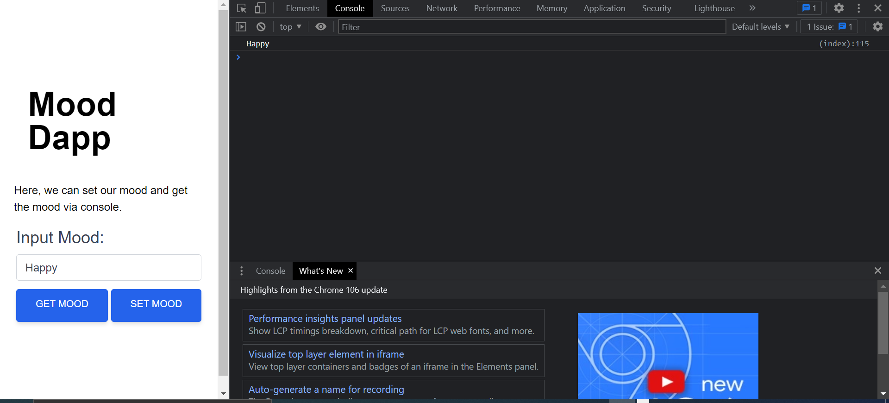

# Mood Dapp

This is my first Decentralized Application where i can set my mood and get the mood via the console.

## list of programing laguages, Frameworks and tools i used for this project include:

* Programming Languages and Frameworks:

  * HTML
  * Tailwindcss
  * Solidity
  * Ethersjs
  

  
* Tools:
       
       * RemixIDE
       * Metamask
       * Goerli faucet
       * Markdown
       * Etherscan (testnet)

